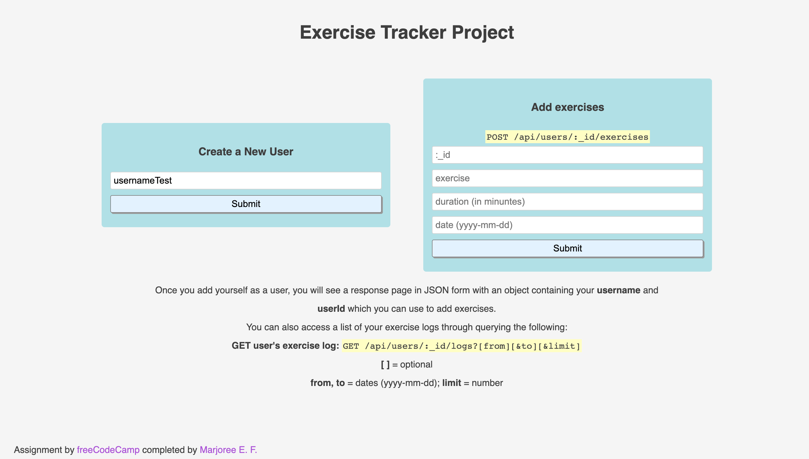
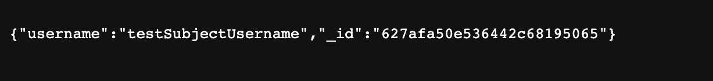
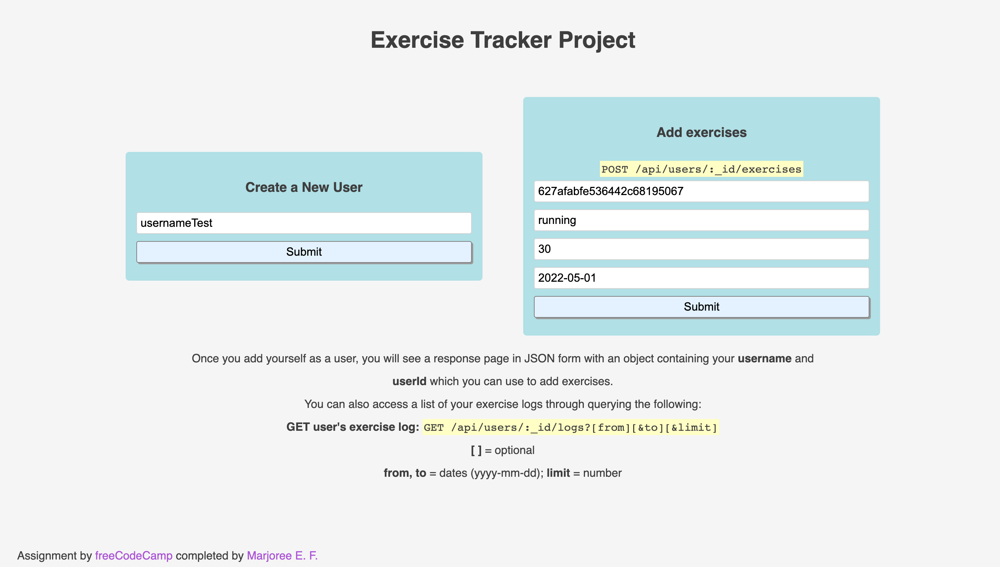
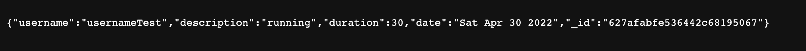
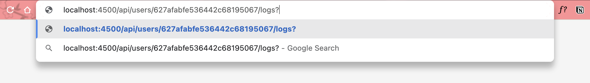
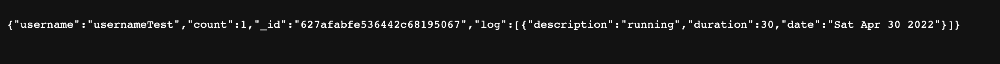

# Exercise Tracker

*A freecodecamp challenge completed by Marjoree E. F. as part of the Backend and APIs Course*

## Objective
The goal of this project is to create a backend-driven exercise tracker app that creates new users and retrieves existing profiles. 
Responses should have the following structures:

## Table of contents

- [Overview](#overview)
  - [How to Use](#how-to-use)  
  - [The challenge](#the-challenge)
  - [Screenshot](#screenshot)
  - [Links](#links)
- [My process](#my-process)
  - [Built with](#built-with)
  - [What I learned](#what-i-learned)
  - [Continued development](#continued-development)
  - [Useful resources](#useful-resources)
- [Author](#author)
- [Acknowledgments](#acknowledgments)

## Overview
Build a full stack JavaScript app that is functionally similar to this:  [Example](https://request-header-parser-microservice.freecodecamp.rocks/). Working on this project will involve you writing your code using one of the following methods:

-Clone this GitHub repo and complete your project locally.
-Use our Replit starter project to complete your project.
-Use a site builder of your choice to complete the project. Be sure to incorporate all the files from our GitHub repo.

### How to Use
Upon cloning the repository, download the necessary packages listed in package.json by running
```
npm i
```
in the terminal. To run the application in a local port, run
```
npm run start
```

### The challenge

Users should be able to pass the following test cases:

1. You should provide your own project, not the example URL. 
2. You can POST to / api / users with form data username to create a new user. 
3. The returned response from POST / api / users with form data username will be an object with username and _id properties. 
4. You can make a GET request to / api / users to get a list of all users. 
5. The GET request to / api / users returns an array. 
6. Each element in the array returned from GET / api / users is an object literal containing a user's username and _id. 
7. You can POST to / api / users /: _id / exercises with form data description, duration, and optionally date. If no date is supplied, the current date will be used. 
8. The response returned from POST / api / users /: _id / exercises will be the user object with the exercise fields added. 
9. You can make a GET request to / api / users /: _id / logs to retrieve a full exercise log of any user.
10. A request to a user's log GET /api/users/:_id/logs returns a user object with a count property representing the number 
// of exercises that belong to that user.
11. A GET request to / api / users /: id / logs will return the user object with a log array of all the exercises added.
12. Each item in the log array that is returned from GET / api / users /: id / logs is an object that should have a description, duration, and date properties.
13. The description property of any object in the log array that is returned from GET / api / users /: id / logs should be a string.
14. The duration property of any object in the log array that is returned from GET / api / users /: id / logs should be a number.
15. The date property of any object in the log array that is returned from GET / api / users /: id / logs should be a string.. Use the dateString format of the Date API.
16. You can add from, to and limit parameters to a GET / api / users /: _id / logs request to retrieve part of the log of any user.from and to are dates in yyyy - mm - dd format.limit is an integer of how many logs to send back. 
*Hint: For the date property, the toDateString method of the Date API can be used to achieve the expected output.*

### Screenshot

Create a new user

Result after creating new user

Create new exercise log

Result after creating new exercise log

Input query to search all logs into searchbar

Result of a user's log entries and a count of how many entries are in their database


### Links

- [Solution URL](https://github.com/mfargas/exercisetracker.git)
- [Live Site URL](https://margie-exercise-tracker.herokuapp.com/)

## My process

### Built with

- HTML
- CSS
- JavaScript
- MongoDB
- mongoose.js
- [Node.js](https://nodejs.org/en/) - JS Runtime
- [Express.js](http://expressjs.com/) - Node.js Framework


### What I learned

To get started, I downloaded dependencies express.js, mongodb, mongoose, body-parser, cors, and dotenv. From there I created a .env file with my mongo connection tokens then referenced the dependencies at the top of my server.js file followed by:
```
mongoose.connect(process.env.DB, {useNewUrlParser: true, useUnifiedTopology: true}, () =>{
  console.log('Successfully connected to DB')
})
```

To access my images and css file, I referenced them next:
```
app.use(express.static('public'))
```
This app uses a lot of asynchronous functions from our learnings on freeCodeCamp to make these requests to the database.

A separate JS file was generated to create place to hold the functions I will import into the server.js file. To add new users in the server, here is a function I added to fun.js:
```
const mongoose = require('mongoose');
const {User} = require('./userSchema');

const addNewUser = async (newUserName)=>{
    try{
        const newUser = new User({ username: newUserName})
        const saveNewUser = await newUser.save()
        return saveNewUser
    } catch (err) {
        throw new Error('User could not be saved')
    }
}
```

I primarily learned to create an app that uses a POST method to create a new user and checks for duplicates of the same username. This is a very basic form of an app with a user database, this is useful for learning to build apps that allow users to log in and access their accounts in future iterations of this type of web app. I plan to create a minor patient portal in the future to build on my learnings of this project.

For the POST method, I used the following in server.js:
```
app.post('/api/users', async (req, res, next) => {

  const userName = req.body.username;

  if(!userName || userName === 0 ){
    return res.json({error: 'Invalid username'})
  } else {
    try{
      const newUser = await addNewUser(userName);
      console.log(newUser)
      res.json({
        username: newUser.username,
        _id: newUser._id
      })
    } catch(err){
      console.error(err)
    }
  }
})
```

The same can be done for the function to update a user and to add new exercises:
```
const findAndUpdateUser = async (userId, objWNewProps) => {
    try{
        const updatedUser = await User.findByIdAndUpdate(userId, 
            {
                $push: {exercises: objWNewProps}
            },
            {new: true}
        )
        const obj = {
            username: updatedUser.username,
            description: objWNewProps.description,
            duration: objWNewProps.duration,
            _id: userId,
            date: objWNewProps.date
        }
        return obj
    } catch (err){
        console.error(err)
        throw new Error('Cannot update user')
    }
}
```

Another function shown here is used to asynchronously update a user's overall log with a new exercise after checking a few formatting properties such as the date format. 

I use an object to hold the new properties for a new exercise such as description, duration, and the date taken from the form our server references. Most of the date formatting specificities were made to satisfy the test run when submitting this project. Mainly to pass test cases #15 and #16.

An Object is in the format we want when pushing to our mongodb database for the user.

```
const addNewExercise = async (exerciseDetails) => {
    try{
        const objWNewProps = {
            description: exerciseDetails.description,
            duration: exerciseDetails.duration,
            date: exerciseDetails.date
        }
        if(!objWNewProps.date){
            objWNewProps.date = new Date().toDateString()
        } else {
            objWNewProps.date = new Date(exerciseDetails.date).toDateString()
        }
        const updatedUser = await findAndUpdateUser(exerciseDetails.id, objWNewProps)
        if(updatedUser){
            const obj = {
                username: updatedUser.username,
                description: updatedUser.description,
                duration: updatedUser.duration,
                date: new Date(exerciseDetails.date).toDateString(),
                _id: updatedUser._id
            }
            return obj
        }else{
            return null
        }
    }catch(err){
        console.log(err)
        throw new Error('Could not add exercise')
    }
}
```

Below is an example of the feedback logged onto the Mongo NoSQL Database, and this is the more extensive use of MongoDB I've worked on

```
**Exercise:**
`{
  username: "fcc_test"
  description: "test",
  duration: 60,
  date: "Mon Jan 01 1990",
  _id: "5fb5853f734231456ccb3b05"
}`

**User:**
`{
  username: "fcc_test",
  _id: "5fb5853f734231456ccb3b05"
}`
**Log:**
`{
  username: "fcc_test",
  count: 1,
  _id: "5fb5853f734231456ccb3b05",
  log: [{
    description: "test",
    duration: 60,
    date: "Mon Jan 01 1990",
  }]
}`
```

The functions used to create the users and exercises partner with the userSchema to generate the JSON response and update our DB. The following is placed at the top of our server.js file after all functions are created in fun.js, the userSchema is created and the proper mongoDB configuration setting are complete:

```
const { addNewUser, getAllUsers, addNewExercise, fetchExercises} = require('./js/fun')
const { Schema } = require('mongoose')
const mongoose = require('mongoose')
```

### Continued development
I intend on returning to this project to also add a password protected login system for people to see a dashboard of their exercise logs.

<!-- ### Useful resources
- [req.ip](http://expressjs.com/en/5x/api.html#req.ip) - 
- [req.get(field)](http://expressjs.com/en/5x/api.html#req.acceptsLanguages) - -->

## Author

- Website - [Marjoree E.F.](https://www.marjoree.com)
- Frontend Mentor - [@mfargas](https://www.frontendmentor.io/profile/mfargas)
- FreeCodeCamp - [@marjoreef](https://www.freecodecamp.org/marjoreef)
- Twitter - [@marjoree_js](https://www.twitter.com/yourusername)

<!-- ## Acknowledgments -->
